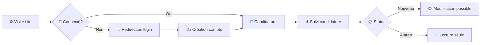

# 🕒 Time Off Module

## 📌 Overview
The **Time Off** module is a custom Odoo add-on designed to streamline employee leave and time-off management.  
It enables employees to request leave, managers to approve or refuse requests, and HR to track leave balances efficiently.

---

## ✨ Features
- 📝 **Leave Requests** – Employees can submit and manage their leave requests.  
- ✅ **Approval Workflow** – Managers can approve or refuse leave requests.  
- 💬 **Refusal Wizard** – Managers can provide detailed feedback when refusing requests.  
- 📄 **Custom Views** – Tailored forms and list views for efficient leave management.  
- 🔒 **Role-based Access Control** – Specific access rights for different user roles.  
- 🌍 **Multilingual Support** – Includes French translation.  

---

## 🛠 Main Components

### 📂 Models
- `hr_leave.py` – Core logic for leave requests, validation, and state transitions.  

### 📂 Wizards
- `leave_refuse_wizard.py` – Wizard interface for managers to refuse leave with a reason.  

### 📂 Views
- `hr_leave_views.xml` – Customized leave request forms and list views.  
- `leave_refuse_wizard_views.xml` – Interface for the leave refusal wizard.  

### 📂 Security
- `ir.model.access.csv` – Defines access rights for various user roles.  

---

# 📸 Module de Recrutement Odoo

<div align="center">


*Module de recrutement moderne avec authentification obligatoire et portail candidat*

</div>

---

## 🚀 Vue d'ensemble

Ce module de recrutement transforme l'expérience de candidature sur votre site Odoo en proposant une interface moderne, sécurisée et intuitive pour les candidats.

### ✨ Points forts

- 🔐 **Sécurité renforcée** - Authentification obligatoire pour toutes les candidatures
- 🎨 **Interface moderne** - Design responsive et élégant
- 📊 **Suivi en temps réel** - Tableau de bord candidat personnalisé
- 🛠️ **Gestion flexible** - Modification des candidatures selon le statut

---

## 🎯 Fonctionnalités principales

<table>
<tr>
<td width="33%" align="center">

### 🌐 Interface Publique
- Interface candidat responsive
- Design moderne avec animations
- Expérience utilisateur optimisée
- Compatible tous appareils

</td>
<td width="33%" align="center">

### 📝 Gestion Candidatures
- Candidature en ligne sécurisée
- Suivi de statut en temps réel
- Modification conditionnelle
- Historique complet

</td>
<td width="33%" align="center">

### 👤 Profil Candidat
- Création de profil personnalisé
- Gestion des informations
- Portail dédié candidat
- Tableau de bord intuitif

</td>
</tr>
</table>

---

## 📦 Modules inclus

### 1️⃣ `recrutement_auth` - Authentification Obligatoire

> 🔐 **Sécurité avant tout** - Les candidats doivent être connectés pour postuler

**Fonctionnalités :**
- ✅ Redirection automatique vers login
- ✅ Session utilisateur sécurisée
- ✅ Protection des données candidat
- ✅ Intégration transparente

### 2️⃣ `recrutement_portal` - Portail Candidature

> 📊 **Tableau de bord candidat** - Interface dédiée pour gérer ses candidatures

**Fonctionnalités :**
- 📄 **Liste des candidatures** - Vue d'ensemble personnalisée
- 🔍 **Détails complets** - Informations détaillées (poste, statut, date)
- ✏️ **Modification conditionnelle** - Édition possible si statut "Nouveau"
---

## ⚙️ Installation & Configuration

### 🔧 Prérequis

Avant de commencer, assurez-vous d'avoir :

- [ ] Odoo 18.0 installé
- [ ] Accès administrateur
- [ ] Modules `website` et `hr_recruitment` activés

### 📥 Étape 1 : Installation des modules

```bash
# 1. Placez les dossiers dans custom_addons/
custom_addons/
├── recrutement_auth/
└── recrutement_portal/
# 2. Activez les modules via l'interface
Applications → Rechercher → Installer
```

### 🍪 Étape 2 : Configuration des cookies

> ⚠️ **Critique** : Sans cookies, la session utilisateur ne peut pas être maintenue

**Chemin :** `Configuration → Site Web → Paramètres`

<div align="center">

</div>

✅ **Activez "Cookies"** dans les paramètres du site web

### 👥 Étape 3 : Activation du compte client

**Chemin :** `Configuration → Site Web → Paramètres → Onglet Fonctionnalités`

<div align="center">

</div>

**Cette option permet :**
- 🆕 Création de compte depuis la connexion
- 👤 Gestion du profil utilisateur
- 📋 Suivi des candidatures personnalisé

### 🌍 Étape 4 : Configuration de la langue

> 🇫🇷 **Important** : Configurez le site en français pour la cohérence des statuts

<div align="center">
<table>
<tr>
<td align="center">

<br><strong>Étape 1</strong>
</td>
<td align="center">

<br><strong>Étape 2</strong>
</td>
</tr>
</table>
</div>

### 🗂️ Étape 5 : Ajout du menu "Mes Candidatures"

**Chemin :** `Site Web → Éditer le menu`

<div align="center">
<table>
<tr>
<td align="center">

<br><strong>Créer l'élément</strong>
</td>
<td align="center">

<br><strong>Configurer le nom</strong>
</td>
<td align="center">

<br><strong>Définir l'URL</strong>
</td>
</tr>
</table>
</div>

**Configuration :**
- 📝 **Nom :** `Mes Candidatures`
- 🔗 **URL :** `/candidate/applications`

---

## 📁 Architecture du projet

```
custom_addons/
│
├── 🔐 recrutement_auth/              # Module d'authentification
│   ├── 📄 __init__.py
│   ├── 📋 __manifest__.py
│   └── 🎮 controllers/
│       └── 🔧 main.py
│
└── 📊 recrutement_portal/            # Module portail candidat
    ├── 📄 __init__.py
    ├── 📋 __manifest__.py
    └── 🎮 controllers/
        └── 🔧 main.py
    └── 🎮 views/
        └── 🔧 menu.xml
        └── 🔧 templates.xml
```

---

## 🔄 Workflow candidat



---

## ✅ Liste de vérification post-installation

- [ ] Modules installés et activés
- [ ] Cookies activés dans les paramètres du site
- [ ] Compte client activé
- [ ] Langue configurée en français
- [ ] Menu "Mes Candidatures" ajouté
- [ ] Test de candidature effectué
- [ ] Vérification du portail candidat

---


## 🔗 Compatibilité & Versions

| Composant | Version | Statut |
|-----------|---------|--------|
|  | 18.0 | ✅ Testé |
|  | 3.8+ | ✅ Compatible |
|  | 12+ | ✅ Recommandé |

---


## 📄 Licence & Contributions

<div align="center">


Ce module est distribué sous licence **LGPL-3**.


</div>


